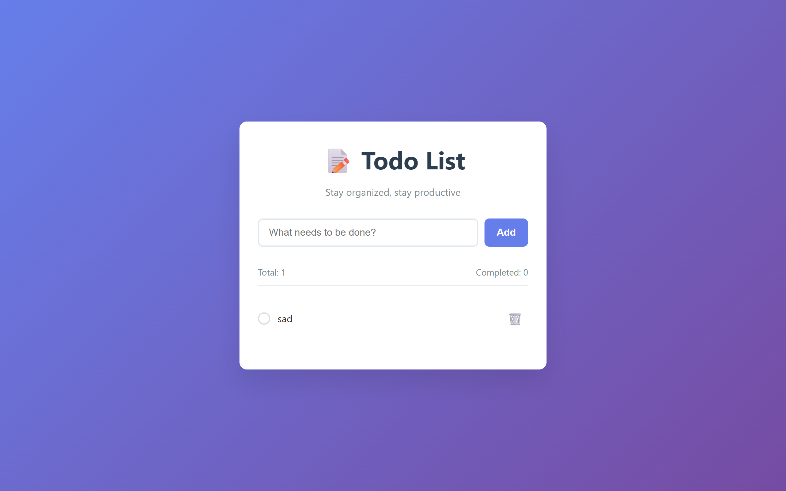

<h1 align="center">📝 Todo App - Vanilla JavaScript</h1>
<p align="center">Una aplicación de gestión de tareas limpia e intuitiva construida con JavaScript puro, con persistencia en localStorage y manipulación dinámica del DOM.</p>

<p align="center">
  <a href="#-características">✨ Características</a> •
  <a href="#-tecnologías">📦 Tecnologías</a> •
  <a href="#-instalación">⚙️ Instalación</a> •
  <a href="#-aprendizajes">🎯 Aprendizajes</a>
</p>

---

## 📸 Demo



> **Demo en Vivo:** [Agrega tu enlace de despliegue aquí] • **Repositorio:** [GitHub](https://github.com/JeremyAyza/vanilla-js-todo-list)

---

## ✨ Características

- ➕ **Agregar Tareas**: Crea nuevas tareas con un formulario simple y la tecla Enter
- ✅ **Alternar Completado**: Marca tareas como hechas/pendientes con checkboxes interactivos
- 🗑️ **Eliminar Tareas**: Remueve tareas individuales con el ícono de basura
- 💾 **Persistencia de Datos**: Todas las tareas se guardan automáticamente usando localStorage
- 🎨 **UI Limpia**: Diseño moderno con CSS puro (sin dependencias externas)
- 📱 **Responsive**: Funciona perfectamente en escritorio y dispositivos móviles
- ⚡ **Rendimiento**: Optimizado con actualizaciones eficientes del DOM y delegación de eventos
- 🔔 **Notificaciones**: Mensajes toast para retroalimentación del usuario
- 📊 **Estadísticas**: Conteo en tiempo real de tareas y seguimiento de completado

---

## 📦 Tecnologías

| Tecnología | Descripción |
|------------|-------------|
|  | Marcado semántico y estructura del documento |
|  | Estilos responsivos personalizados y animaciones |
|  | JavaScript puro vanilla (sin frameworks) |
|  | Persistencia de datos basada en el navegador |
|  | Íconos y animaciones personalizadas solo con CSS |

---

## 🎯 Aprendizajes y Desafíos

- [x] **Manipulación del DOM**: Dominé las operaciones del DOM con JavaScript vanilla sin frameworks
- [x] **Delegación de Eventos**: Implementé manejo eficiente de eventos para contenido dinámico
- [x] **Gestión de Estado**: Construí gestión de estado personalizada usando arrays y localStorage
- [x] **Persistencia de Datos**: Aprendí APIs de almacenamiento del navegador para funcionalidad offline
- [x] **Diseño Responsive**: Creé CSS mobile-first con media queries
- [x] **Optimización de Rendimiento**: Usé estrategias de renderizado eficientes para actualizar solo elementos necesarios del DOM
- [x] **Arquitectura de Clases**: Implementé patrones de programación orientada a objetos con ES6
- [x] **Manejo de Errores**: Agregué validaciones y manejo robusto de errores

---

## ⚙️ Instalación

### Prerrequisitos
- Un navegador web moderno (Chrome, Firefox, Safari, Edge)
- ¡No se requieren dependencias adicionales!

### Inicio Rápido

```bash
# Clona el repositorio
git clone https://github.com/JeremyAyza/vanilla-js-todo-list

# Navega al directorio del proyecto
cd vanilla-js-todo-list

# Abre el archivo HTML en tu navegador
open index.html
# o simplemente haz doble clic en index.html
```

### Alternativa: Live Server
Si tienes VS Code con la extensión Live Server:
```bash
# Clic derecho en index.html → "Open with Live Server"
```

---

## 🚀 Uso

1. **Agregar Tareas**: Escribe tu tarea en el campo de entrada y presiona Enter
2. **Completar Tareas**: Haz clic en el checkbox circular junto a cualquier tarea
3. **Eliminar Tareas**: Haz clic en el ícono de basura para remover tareas no deseadas
4. **Persistencia de Datos**: Tus tareas se guardan automáticamente y persistirán entre sesiones del navegador

---

## 🔧 Estructura del Proyecto

```
vanilla-js-todo-list/
├── index.html             # Archivo HTML principal
├── css/
│   └── styles.css         # Estilos CSS optimizados
├── js/
│   └── app.js             # Lógica de la aplicación JavaScript
├── assets/
│   └── images/
│       └── favicon.png    # Ícono de la aplicación
└── README.md              # Documentación del proyecto
```

---

## 🎨 Características del Diseño

- **Diseño de Tarjeta Moderno**: Tarjeta blanca limpia sobre fondo con gradiente
- **Elementos Interactivos**: Efectos hover y transiciones suaves
- **Tipografía**: Fuentes del sistema para mejor rendimiento
- **Esquema de Colores**: Colores turquesa profesionales y acentos amarillos
- **Grid Responsive**: Se adapta a diferentes tamaños de pantalla
- **Animaciones CSS**: Transiciones fluidas para una mejor experiencia de usuario

---

## 🔮 Mejoras Futuras

- [ ] Agregar categorías o etiquetas para las tareas
- [ ] Implementar funcionalidad de edición de tareas
- [ ] Agregar fechas de vencimiento y recordatorios
- [ ] Crear filtros de tareas (todas, completadas, pendientes)
- [ ] Implementar toggle de modo oscuro
- [ ] Agregar funcionalidad de arrastrar y soltar para reordenar
- [ ] Implementar búsqueda de tareas
- [ ] Agregar exportación/importación de datos

---

## 📄 Licencia

Este proyecto es de código abierto y está disponible bajo la [Licencia MIT](LICENSE).

---

## 👨‍💻 Autor

**Jeremy Ayza** - *Desarrollador Frontend*
- GitHub: [@JeremyAyza](https://github.com/JeremyAyza)
- Portfolio: [Tu portfolio aquí](https://tu-portfolio.com)

---

<p align="center">
  <i>Construido con ❤️ usando Vanilla JavaScript</i>
</p>